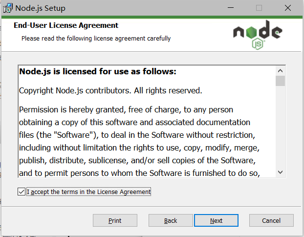
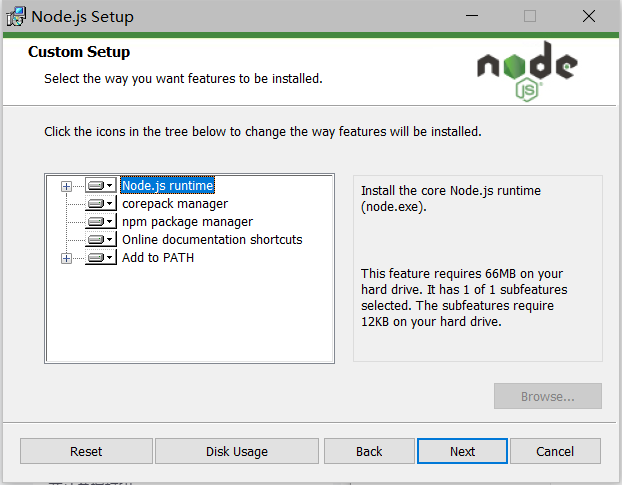
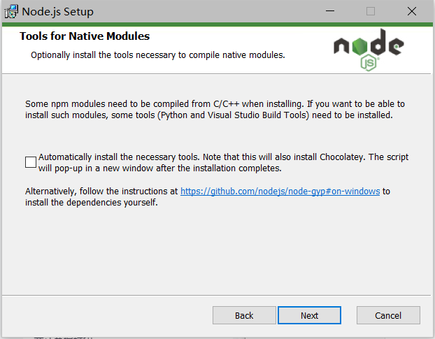
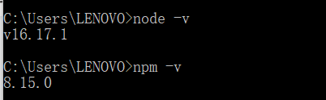
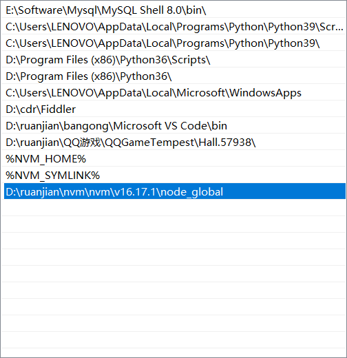
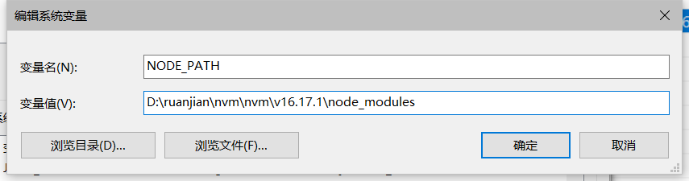
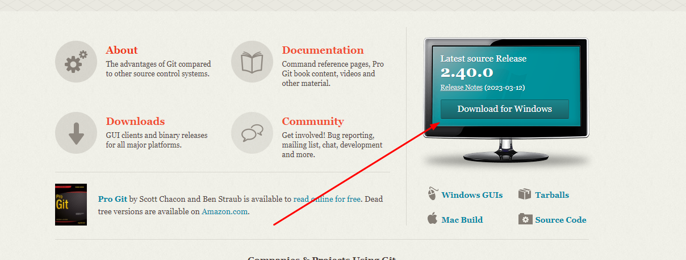
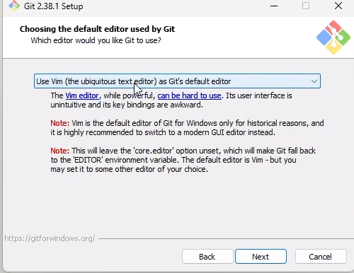
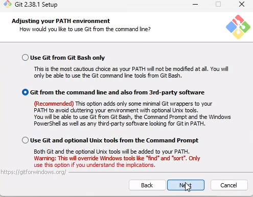

# Hexo搭建个人博客

[Hexo](https://hexo.io/zh-cn/)是一款基于Node.js的静态博客框架，它包含许多自定义主题和插件

## hexo搭建流程

### 1. Node.js的安装及环境变量的配置

Hexo是基于node.jS编写的，所以需要安装一下node.js和里面的npm工具（node安装完成后会自带npm包管理工具）

[Node.js](https://nodejs.org/zh-cn/)官方下载地址，这里个人建议下载TSL，下载完后点击安装

1. 勾选接受

​	

2. 选择安装路径，不建议安装到C盘涉及管理员权限问题可能会导致npm安装失败
3. 下一步，默认选项

​	

4. 这里不勾选

	​	

5. 安装完成后，打开cmd命令窗口分别输入node -v和npm -v，若出现版本号则代表安装成成功

	

6. 在刚刚你安装的node目录下创建“node_cache”和“node_global”两个文件夹，以管路员模式打开cmd并输入如下指令

	```bash
	#配置全局包存放路径，不配置默认在C盘
	npm config set prefix "D:\xxx\xxx\node_global"
	#配置缓存路径
	npm config set cache "D:\Program Files\nodejs\node_cache"
	```

7. 配置环境变量，我的电脑—>右击—>属性—>高级系统设置—>高级—>环境变量

	1. 在用户变量的Path上新增D:\xxx\node_global，刚刚创建node_global的目录，点击确认

		

		2. 在系统变量上新建一个，变量名为NODE_PATH，值为“D:\xxx\node_modules”，该文件夹在node的安装目录下

			

		3. 在系统变量Path里添加%NODE_PATH%

### 2. Git的安装

[Git](https://git-scm.com/)官网，下载安装包，安装即可，官网速度太慢时可以去[淘宝镜像网站](https://registry.npmmirror.com/binary.html?path=git-for-windows/)下载



注意以下几点，其余默认选项即可

1. 这里选择默认编辑器，选你常用的即可



2. 这里选择第二个，会配置一部分的环境变量

	

	3. 配置git环境

		```bash
		git config --global user.name "用户名"     # 配置用户名
		
		git config --global user.email "xxxx@xx.com"  #  配置邮箱
		
		```

### 3. Hexo的安装及部署

1. 由于国内镜像源安装速度慢，所以先安装cnpm的淘宝镜像源

	```bash
	npm install -g cnpm --registry=https://registry.npm.taobao.org
	```

2. 安装hexo

	```bash
	cnpm install -g hexo-cli
	```

3. 创建一个目录名字随意，在该目录下打开git命令窗口，执行以下命令初始化一个hexo项目

	```bash
	hexo init   #初始化hexo
	npm install #安装一些依赖
	hexo serve  #开启预览服务访问端口 可以简写为 hexo s   之后就可以通过本地4000端口来查看博客效果
	hexo clean   #清除缓存文件db.json和已生成的静态文件public  
	```

4. 将博客部署到github

	- 首先在github创建一个仓库，仓库名必须为`xxxx.github.io`，xxx是你的github名称

	- git配置ssh公密钥

		```bash
		git ~./ssh  #先查看是否已经生成过秘钥 若无此文件执行下面操作
		ssh-keygen -t rsa -C 'xxxx@qq.com'  #这里生成密钥，xxx表示你的邮箱
		cd ~./ssh    cat id_ras.pub #进入ssh目录，查看生成的公钥文件，将其复制到你github配置的ssh key中即可
		```

	- 安装hexo部署插件

	```bash
	cnpm install --save hexo-deployer-git #安装部署插件
	```

	- 对博客目录下的`_config.yml`文件进行配置，在文件最底部

		```bash
		# Deployment
		## Docs: https://hexo.io/docs/one-command-deployment
		deploy:
		  type: git
		  repo: xxxxxxxx     #表示github的仓库地址
		  branch: xxx       #部署的分支
		
		
		#后续部署流程
		hexo generate  #生成网站静态文件     可以简写为 hexo g
		hexo deployer  #部署到上述配置的仓库地址中     可以简写为 hexo d
		```

